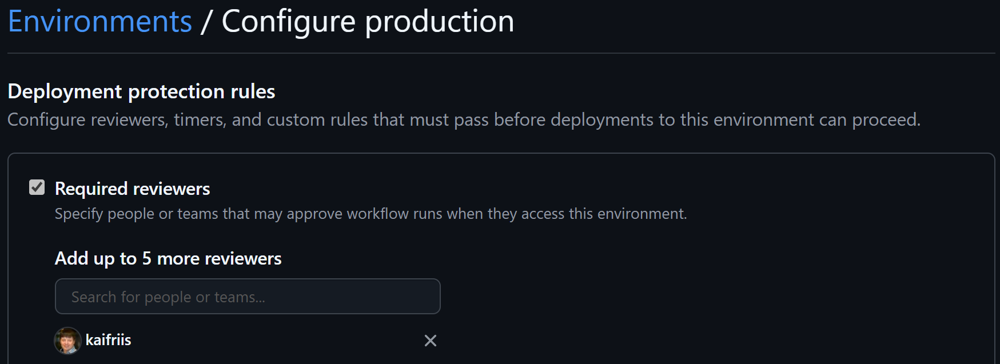
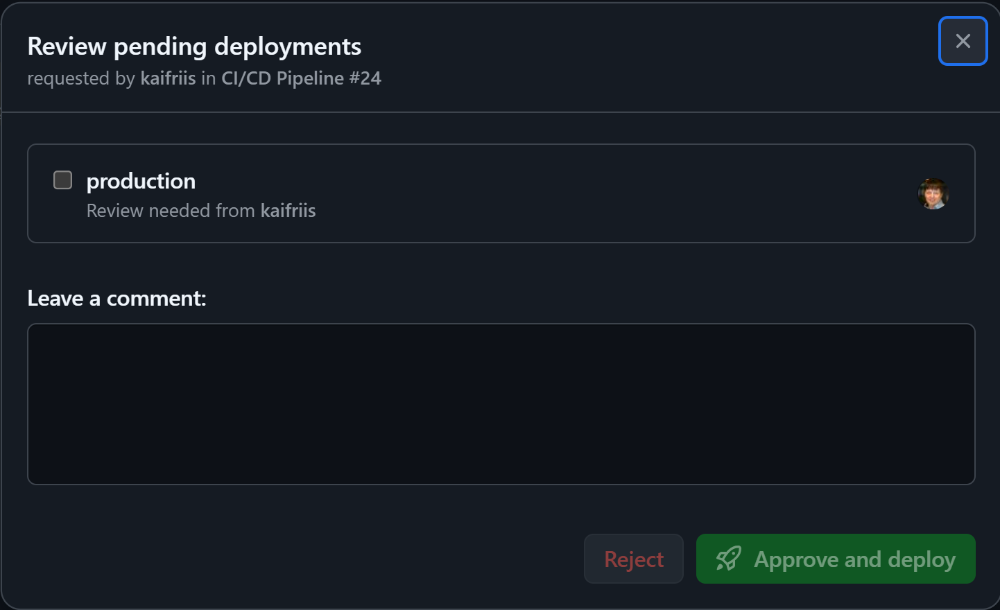

# GitHub Devops

Denne leksjonen tar for seg devops. Vi bruker her GitHub som er en plattform som inneholder tjenester man trenger for å drive et moderne utviklingsprosjekt.

>GitHub er en av to plattformer Microsoft tilbyr for å implementere en devops pipeline. Azure Devops er den "klassiske" plattformen som fortsatt har mest funksjonalitet som understøtter store bedrifts prosjekt, men GitHub er plattformen Microsoft ønsker å gå videre med selv om Azure Devops blir ikke lagt ned på lenge. Vi bruker GitHub i denne leksjonen også fordi den er enklere å bruke som enkeltperson og derfor egner seg ypperlig til å teste på.

I denne leksjonen skal vi lage bygg og release pipeline for løsningen som ble laget i workshop 1. I grove trekk skal vi gjøre følgende:

1. Lage et nytt prosjekt i [GitHub](https://github.com/)
2. Sette opp pipeline med build og delivery skritt
3. Sette opp release, hvis du har et MSDN abonnement
4. Gjøre endringer til kildekoden
5. (Valgfritt) Lage App Services i [Azure](https://portal.azure.com)
6. Publisere til alle miljøene

>**Forutsetninger** for denne leksjonen er at du har både en egen github konto og en egen Azure subsription. Enten som en del av MSDN eller en demo Azure konto.

## Nytt repo i GitHub

Gå til [GitHub](https://github.com/) og logg inn.

Om du ikke har registrert deg på GitHub, opprett ny bruker lag en nytt repository. Du kan godt gjøre det offentlig siden det gir deg mer "kreditt" og repo er bare for å teste.

I tillegg til versjonskontroll med Git består GitHub av moduler for å drive utviklingsprosesser, som prosjekt, automatisering og overvåkning. Vi skal her konsentrere oss om å bruke automatisering til å sette opp en CI/CD pipeline. (I GitHub kan du automatisere mer enn bare bygging av pipeline.)

>### GitHub er strukturert som følger
>
>- **Repository:** Repository er der prosjektets filer og revisjonshistorikk er lagret. De støtter samarbeid ved å la flere bidragsytere jobbe på samme prosjekt, spore endringer og administrere versjoner.
>- **GitHub Actions:** GitHub Actions kan brukes som en CI/CD-plattform (Continuous Integration/Continuous Deployment) som automatiserer arbeidsflyter. Den lar deg bygge, teste og distribuere koden din direkte fra GitHub.
>- **Prosjekter:** GitHub Projects er et prosjektstyringsverktøy som integreres med depotene dine. Det hjelper deg med å organisere og prioritere arbeidet ditt ved hjelp av tavler i Kanban-stil.
>- **Overvåking:** GitHub inneholder overvåkingsverktøy for å spore statusen og ytelsen til arbeidsflytene og repositoriene dine. Dette inkluderer visning av logger, måledata og varsler.
>- **Artifacts:** @actions/artifact pakken i GitHub Actions brukes til å laste opp og laste ned artefakter i arbeidsflytene dine. Artefakter er filer eller samlinger av filer som genereres under en arbeidsflytkjøring, for eksempel kompilering, testresultater eller loggfiler. Denne pakken lar deg beholde disse filene etter at en jobb er fullført og dele dem mellom jobber i samme arbeidsflyt.
>- **@actions:** GitHub har et helt bibliotek med actions som du kan laste ned å bruke i en automatiseringsprosess du ønsker å opprette.

>### Komponenter i en GitHub arbeidsflyt
>
>1. **Workflow:** En arbeidsflyt er en automatiseringsenhet fra start til slutt, inkludert definisjonen av hva som utløser automatiseringen, hvilket miljø eller andre aspekter som bør tas i betraktning under automatiseringen, og hva som skal skje som et resultat av utløseren.
>2. **Job:** En jobb er en del av arbeidsflyten, og består av ett eller flere trinn. I denne delen av arbeidsflyten definerer malen trinnene som utgjør byggejobben.
>3. **Step:** Et trinn representerer én effekt av automatiseringen. Et trinn kan defineres som en GitHub-handling, eller en annen enhet, som å skrive ut noe til konsollen.
>4. **Action:** En handling er en del av automatiseringen som er skrevet på en måte som er kompatibel med arbeidsflyter. Handlinger kan skrives av GitHub, av åpen kildekode-fellesskapet, eller du kan skrive dem selv!

## Opprett nytt repo

Først la oss opprette en dafult action og se hvordan vi kan koble den til en arbeidsflyt

### Aktivitet: Opprett standard arbeidsflyt

1. Åpne din GitHub konto i en nettleser.
2. Opprett et nytt repo. Valgfritt: Legg på beskyttelse av main branch.
3. Gå til **Actions** fanen.
4. Klikk på **New workflow**.
5. Søk etter "Simple workflow" and klikk konfigurer.
6. Gi din arbeidsflyt et navn som f.eks, **ci.yml**.
7. Klikk **Commit changes...**, og velg å opprette en ny branch og gi den navnet ci. Ikke velg merge til main direkte.
8. Klikk **Propose changes**.
9. Klikk **Create pull request**.
10. Vent noen sekunder og velg å laste inn siden på nytt.
11. Sjekk framdrift og status på jobben

### Filstruktur

Åpne koden i ditt repository. Kan du finne den fila du nettopp opprettet?

### Lokalt miljø

1. Klon repoet ditt til ditt lokale miljø
2. Åpne yaml fila i VS Code.

### 2: Redigere Bicept

Åpne **ci.yml** fila du lagde ovenfor og endre på bicep koden. Du kan for eksempel liste ut dato og antall filer i repo:

```yaml
      - name: Run a simple script
        run: |
          echo "Running a simple script"
          echo "Current date and time: $(date)"
          echo "List of files in the repository:"
          ls -la
```

Sjekk inn koden og lag en PR til deg selv. Se at pipeline kjører når du ber om PR.

## Start prosjekt 2

Gjør en fork av Leksjon 2 Start prosjektet her: xxxxxxxxx

### 5: Github Actions pipeline

Nå som du har opprettet et prosjekt i Github Actions og "forke" et Git repo kan vi sette opp en pipeline for å automatisere bygging og testing av applikasjonen.

La oss først bygge prosjektet med Github Actions. Vi skal senere kombinere alle Bicep modulene vi oppretter til en sammenhengende bicept fil som bygger prosjektet, kjører tester, logger på Azure og publiserer koden til Azure.

#### Legg til test miljø

VI trenger å legge til et test miljø i vårt GitHub repo. I føreste omgang trenger vi bare selve miljøet, senere skal vi legge til verdier som vi skal bruke i workflow.

- Velg **Settings** fanen på forsiden av ditt GitHUb repo
- I menye til venstre velg **Environments**
- Klikk **New Environement** gi det navnet test. Hopp over resten. Vi kommer tilbake til denne senere.

#### BICEP script

>Merk. Trigger av action **on: workflow_dispatch** er her satt opp med manuell trigger for at vi enklere skal kunne kjøre workflow for debugging.

```yaml
# Workflow name - appears in GitHub Actions UI
name: Build and Deploy .NET Web App

# Define when this workflow should run
on:
  push:
    branches:
      - '**'  # Triggers on push to any branch - useful for development
  workflow_dispatch:  # Enables manual trigger from GitHub UI - helpful for testing

# Jobs are the main building blocks of a workflow
jobs:
  build:
    # Specifies the type of runner to execute the job
    runs-on: ubuntu-latest

    # Sequential steps to be executed as part of the job
    steps:
    # Check out your repository code to the runner
    - name: Checkout code
      uses: actions/checkout@v4

    # Set up .NET SDK environment
    - name: Setup .NET Core
      uses: actions/setup-dotnet@v4
      with:
        dotnet-version: '8.0.x'  # Specifies .NET 8 version

    # Set up Node.js for frontend dependencies
    - name: Setup Node.js
      uses: actions/setup-node@v4
      with:
        node-version: '18'

    # Install frontend dependencies from package.json
    - name: Install npm packages
      working-directory: ./AzureWorkshopApp  # Changes directory to where package.json is located
      run: npm install

    # Restore .NET project dependencies
    - name: Restore dependencies
      run: dotnet restore

    # Build the .NET project in Release mode
    - name: Build
      run: dotnet build --configuration Release --no-restore  # --no-restore skips restore since we already did it

    # Publish the application - creates deployment-ready files
    - name: Publish
      run: dotnet publish ./AzureWorkshopApp/AzureWorkshopApp.csproj --configuration Release --output ./publish --no-build

    # Upload the published app as an artifact
    - name: Upload artifact
      uses: actions/upload-artifact@v4  # v4 is the latest version as of 2024
      with:
        name: dotnet-app  # Name of the artifact in GitHub
        path: ./publish   # Directory containing files to upload
```

### Artifact

Du kan se hva du nettopp har bygget ved å:

- Gå inn på **Actions**
- Klikk på det bygget du vil se på
- Nederst på siden ser du resultatet av ditt bygg som en zip fil: **dotnet-app**

## Konfigurere GitHub actions tilgang til Azure

Nå som vi har satt opp en Github Actions pipeline, er det på tide å sette opp en deploy pipeline til Azure. For å få det til må vi i tillegg til selve deploy pipeline også sette opp pålogging fra Github Actions til Azure. For å få det til må vi legge Github "pipeline" inn som en applikasjon i Azure Entra Id og gi den applikasjonen tilstrekkelige rettigheter til å kunne publisere kode til Azure. (I denne leksjonen vil vi bare se på å publisere en applikasjon til en eksisterende infrastruktur. Vi vil ikke se på å publisere infrastruktur som kode.)

### Lag en web app

Vi starter i Azure Entra ID før vi går over til GitHub.

>Azure subsription
>
>Bruk din MSDN subscription hvis du har. Hvis du ikke har kan du opprette en test bruker med en epost konto du ikke har brukt tidligere.

## 4: Sett opp forbindelse mellom GitHub og Azure Portalen

Vi trenger å sette opp en tilgang for GitHub Actions til din subscription i Azure. Dette kan gjøres med federated identity mellom GitHub og Azure Entra ID med OpenID Connect.

Vi skal bruke Azure Login-action med Open ID Connect (OIDC). Først må vi konfigurere en federated identity credential på en Microsoft Entra applikasjon.

### Opprett app registration i Azure

Logg inn i Microsoft Entra Admin Center med din MSDN eller Azure Demo konto, ikke Bouvet.

1. Gå til [Entra ID admin](https://entra.microsoft.com/)

#### App registration

- I Microsoft Entra admin center velg **App registration** under **Applications**
- Velg **New registration**.
- Gi applikasjonen et brukervennlig navn som: GitHub-devops.
- Velg single tenant API aksess.
- Hopp over de valgfrie alternativene.
- Klikk **registrer**.

I tillegg må du gi din app registration reader tilgang til din subscription for å kunne logge på Azure fra GIthub Actions.

- Åpne din subscription i Azure portalen
- Velg **Access control (IAM)** og legg til ny rolle.
- Velg **Role assignments** under add fanen. **Role** fanen er valgt som standard.
- Velg **Job function roles** og søk etter **Reader** rollen. Velg denne.
- Bytt til **Memeber** fanen
- Under **Assign access to** velg **User, group, or service principal**
- Klikk **+ Select members** og søk etter din app registration "GitHub-devops".
- Klikk **Select** for å legge denne til.
- Til slutt klikk **Review and assign** en gang for å sjekke potensielle endringer og klikk en gang til for å iverksette ednringer.

#### Federated credetials

Gå inn på applikasjonen du nettopp registrerte: (GitHub-devops)

- Velg «Certificates and secrets».
- Klikk på «Federated Credentials» fanen
- Klikk på «Add credentials»

På **Add a credential** siden

- Under Federated credential scenario velg:
  - **Github actions deploying Azure resources**
- **Organization**: Din GitHub organisasjon
- **Repository**: Ditt repo
- **Entity type**: Her velger du hvilken entitet som skal være en del av hemmeligheten som styrer tilgang i Azure. For GitHub kan du velge: Environment, Branch, Pull request eller Tag.
- Velg **Environment** og skriv **test**.

>Innholdet i feltet Subject identifier er det vi skal generere i vår bicrpt skript og sende til Azure Entra. Dette blir subject claim i JWT, det som står her må stemme 100 % med det du skriver i GitHub actions. Hvis det ikke stemmer vil du få en feilmelding.

- Klikk **Create**
  
### Legg til hemmeligheter til Github repo

Naviger til GitHub og åpne ditt repo. Vi skal nå legge til informasjon om vår applikasjons innstillinger inn som hemmeligheter i Github for å kunne sette opp integrasjon mellom Github og Entra ID.

Vi trenger:

- Azure CLient ID: Denne finner du på siden til din applikasjons registrering i Entra ID. (Kalt Github-devops tidligere.)
- Tenant ID finner du på samme app reg side.
- Subscription ID finner du ved å gå inn i Azure portalen.

Vi skal legge til sikkrhet på repo nivå: Gå til:
**Settings > Secrets and variables > Actions > New repository secret**.

Leg til disse tre hemmelighetene, en om gangen:

- AZURE_CLIENT_ID: Din application (client) ID
- AZURE_TENANT_ID: Din directory (tenant) ID
- AZURE_SUBSCRIPTION_ID: Din subscription ID

Klikk **Add Secret** etter hver gang.

Merk at du kan ikke se den hemmelighetene du har lagt inn i ettertid, men du kan slette den og legge til en ny.

## 5 test forbindelsen

For å teste forbindelsen vi nettopp har satt opp skal vi skrive en liten BICEP fil.

1. Opprett en nye yaml fil i **workflows** katalogen. Kall den noe slikt som azure-login.yaml.

```yaml
# Name of the workflow - this appears in the GitHub Actions UI
name: Azure Login

# Defines when this workflow can be triggered
on:
  workflow_dispatch:  # Allows manual triggering from GitHub UI
  workflow_call:      # Allows this workflow to be called by other workflows

# Security permissions needed for Azure authentication
permissions:
  id-token: write    # Required for Azure OIDC authentication
  contents: read     # Needed to read repository contents

jobs:
  login:
    runs-on: ubuntu-latest     # Specifies the type of virtual machine to run on
    environment: test          # Links to GitHub Environment named 'test' with its secrets

    steps:
    # Clear any existing Azure credentials to ensure clean authentication
    - name: Clear Azure CLI Account
      run: |
        az account clear
    
    # Check out the repository code - needed for accessing workflow files
    - name: Checkout
      uses: actions/checkout@v2

    # Authenticate with Azure using OIDC (OpenID Connect)
    # This is more secure than using traditional service principal secrets
    - name: Azure Login
      uses: azure/login@v1
      with:
        # These secrets should be configured in your GitHub Environment
        client-id: ${{ secrets.AZURE_CLIENT_ID }}         # Azure AD application ID
        tenant-id: ${{ secrets.AZURE_TENANT_ID }}         # Azure AD tenant ID
        subscription-id: ${{ secrets.AZURE_SUBSCRIPTION_ID }} # Azure subscription ID

    # Verify the Azure connection was successful
    # Useful for debugging and confirming authentication worked
    - name: test Azure Connection
      run: |
        echo "Running in environment: ${{ env.ENVIRONMENT }}"
        az account show
```

>Her styrer vi tilgangen til Azure ved å sette miljøet til test som er det samme som vi satte opp når vi opprette aaplikasjonen i Azure Entra Id.
>Hadde vi benyttet branch som subjekt i Entra måtte vi nå ha sjekket inn på samme barnch som vi hadde satt i app registreringen.

## Infrastruktur i Azure

For å kunne deploye må vi ha noe å deploye til. Lag en web App Service for test, og en for prod i [Azure](https://portal.azure.com).

Det er som oftest lurt å lage separate ressursgrupper for forskjellige miljøer. Når det gjelder app service plan trenger vi ikke noen kraftige greier. Det holder med en F1 pricing tier. Anbefaler at dere gir ressursgruppene, app service planene, og app servicene et navn som gjør det lett å få oversikt over hvilke Azure ressurser som hører til hvilket miljø. Dette gjør det lettere å identifisere miljøene når vi skal sette opp build pipelinen. Eksempelvis for app servicene:
Microsoft har en abefalt navnestandard for å navngi ressurser i Azure. Standarden har følgende struktur:
>Ressurs type - navn på artifact - miljø - Azure region - versjon.

**rg** er forkortelsen for ressursgruppe, **azskolen** er vår forkortelse for Azure Skolen, **test** er miljøet. Siden denne ressursgruppen ikke vil ha flere instanser og bare vil eksistere i ett miljø dropper vi de to siste elementene i navnet.

- **test**: rg-azskolen-test
- **Prod**: rg-azskolen-prod

Du kan finne flere forkortelser for Azure ressurser her:
[Abbreviation recommendations for Azure resources](https://learn.microsoft.com/en-us/azure/cloud-adoption-framework/ready/azure-best-practices/resource-abbreviations)

>Manuell opprettelse av Azure ressurser
>
> Merk at vi her oppretter Azure resurser dirkete i portalen. Dette er for å forenkle øvingsoppgaven. Det man heller vil ønske å gjøre i et utviklingsprojsket er å benytte Github actions automatisering til også å opprette ressursene i Azure ved hjelp av Bicep kode.

Fremgangsmåte:

1. Gå til [Azure](https://portal.azure.com)
2. Lag en resource group for hvert av miljøene. Se navnestandard ovenfor.
3. Lag en **Web App (app)** for hvert av miljøene, som du kopler opp mot hvert sin resource group og hver sin service plan.

    - **Name:** Starter på app-. Dette navnet må være unikt i hele Azure, da den vil kunne nås fra &lt;appservicenavn&gt;.azurewebsites.net.
    - **Publish:** Code
    - **Runtime Stack:** .NET 8 (LTS)
    - **OS:** Linux eller Windows
    - **Region:** Benytt samme region som ressursgruppen. (Det er alltid en god ide å benytte samme region som flesteparten av dine brkere er.)
    - **App service plan:** Azure vil opprette en app service plan for deg.
    - **Pricing plan:** Endre sku and size til Free F1 under dev/test.

4. Klikk på review and create.

### 3: Opprett storage account i Azure

For at web applikasjonen skal fungere i begge miljøer, behøver vi en storage account for test, og en for prod.
Storage accountene opprettes i samme ressursgruppe for web applikasjonen.

>Fordelen med å ha alle ressurser i samme ressursgruppe er at det gjør det enklere å administrere ressursene som applikasjonen bruker. Man kan f.eks. slette alle ressurene som applikasjonen bruker samtidig ved å slette selve ressursgruppen.

1. Gå til [Azure](https://portal.azure.com)
2. Lag en storage account for hvert miljø, velg samme ressursgrupper som web applikasjonen.
   - **Storage account name (st)** Navnet må være unikt i hele azure, state med **st** og ha en lengde fra 3-24 tegn og kan kun innholde små bokstaver og tall. Merk, her er det ikke tillatt med bindestrek i navnet.
   - **Region** Velg samme region som ressursgruppen.
   - **Primary service** Velg **Azure Blob Storage or Azure Data Lake Storage Gen 2**
   - **Performance** Standard
   - **Redundancy** LRS (3 kopier eksisterer kun i samme datasenter.)

3. Klikk på Review og create.
4. Gå til Opprettet storage account, og navigerer inn i **Blob Containers**.
5. Opprett en ny Container som du kaller for: **imagecontainer**. Contaneren vil ha private access level siden vi satte det på selve Storage kontoen.

## Github actions pipeline

Vi skal nå fullføre vår GitHub Actions til Azure pipeline. Siste module vi mangler er deploy. For å kunne fullføre dette siste skrittet kreves det at du har en Azure subscription. Hvis du ikke har en MSDN subscription kan du bruke en demo konto.

### Azure rettigheter

For at Github Actions skal kunne publisere til vår web app i Azure må den service principal som vi opprettet ha riktig rettigheter. For å publisere kreves **contributor** rollen. Dette er en priviligert rolle som har litt mye rettigheter ut fra prinsippet om **Principle of Least Privilege**. Vi kan komme rundt det ved å lage en egendefinert rolle, men det er utenfor "scope" for denne leksjonen. Vi legger rettighetene på ressursgruppe, som regel legger vi ikke til rettigheter direkte på ressursen siden det fort blir alt for mye å holde styr på.

- Ressursgruppen du opprettet i Azure tidligere. (rg-azskolen-test)
- Velg **Access control (IAM)** fra menyen til venstre.
- Klikk på **+ Add** og velg **Add role assignment**
- Velg fanen **Privileged administrative role**.
- Velg **Contributor** fra listen. (Som sagt, vær forsiktig med denne.)
- Klikk **Next**. Det vil åpne **Members** fanen.
- Sjekk at valgt rolle er Contributor.
- Under **Assign access to** velg **User, group or service principal**.
- Klikk på lenken **+  Select members** og søk etter github app registration du laget tidligere.
- Trykk på **Select** knappen og velg **Review + assign** knappen. Vi trenger ikke konfigurere mer.
- Trykk på **Review + assign** knappen til slutt for å tilordne rettigheter til din serviceprincipal.

>Gjør dette på både **test** og **produksjon** ressursgruppene du har opprettet.

### Main.yml

Tilbake til GitHub actions. Nå som rettigheter er satt kan vi fullføre pipline til å inkludere deploy.
>Merk. Når vi nå syr sammen alt må vi gjøre noen endringer i de filene vi allerede har skrevet.
For å koble de ulike bicep modulene sammen må vi opprette en bicep fil som refererer til de ulike modulene. For at denne filen skal kunne trigge bicep scriptene i de andre modulene må disse bicep scriptene ha en trigger av type "workflow_call". Tidligere satte vi tillatelser til å skrive id-token og lese innholdt i vår **azure-login.yml** fil. Disse instillingtene må vi nå flytte til **Main.yml**. (Du kan fjern dem fra login fila, eller slette hele login fila siden vi ikke trenger den mer.)

```yaml
# This is the main orchestrator workflow that coordinates the entire CI/CD pipeline
# It demonstrates how to organize deployments into separate, reusable workflows
name: CI/CD Pipeline

# Add permissions block at workflow level
permissions:
  id-token: write    # Required for OIDC authentication with Azure
  contents: read     # Required for checking out code

# Define when this workflow should run
on:
  push:
    branches:
      - '**'  # Runs on any branch push - useful during development
  workflow_dispatch:  # Allows manual triggers from GitHub UI

# Jobs run in parallel by default unless 'needs' is specified
jobs:
  # First job: Build the .NET application
  build:
    uses: ./.github/workflows/build.yml  # References our build workflow. It compiles the app and creates artifacts

  # Third job: Deploy using Bicep
  deploy:
    uses: ./.github/workflows/deploy.yml  # References our deployment workflow
    secrets: inherit  # Inherits secrets for Azure deployment
    needs: [build]  # This job won't start until both 'build' and 'login' complete. It ensures we have built artifacts and Azure authentication before deployment
```

### deploy.yml

Nå må generere deploy bicep skriptet. Siden credentials ikke består mellom moduler, må vi legge inn Azure pålogging i deploy skriptet. Vi vil ikke lengre bruke påloggingsskriptet fra tidligere. 

```yaml
# This workflow handles the deployment of our application to Azure Web App Service
# It's called by the main.yml workflow after build and login steps complete
name: Deploy to Azure

# Indicates this workflow can be called by other workflows
# This enables modular workflow design and reusability
on:
  workflow_call:

jobs:
  deploy:
    runs-on: ubuntu-latest    # Using Ubuntu for deployment tasks
    environment: test         # Links to GitHub Environment 'test' containing deployment variables
    
    steps:
    # Move Azure login step
    - name: Azure Login
      uses: azure/login@v1
      with:
        client-id: ${{ secrets.AZURE_CLIENT_ID }}
        tenant-id: ${{ secrets.AZURE_TENANT_ID }}
        subscription-id: ${{ secrets.AZURE_SUBSCRIPTION_ID }}

    # First, retrieve the build artifacts that were created in the build job
    # These artifacts contain our compiled application ready for deployment
    - name: Download artifact
      uses: actions/download-artifact@v4
      with:
        name: dotnet-app      # Must match the artifact name from build.yml
        path: ./publish       # Local path where artifacts will be downloaded

    # Deploy the application to Azure Web App
    # This step requires prior Azure authentication from azure-login.yml
    - name: Deploy to Azure Web App
      uses: azure/webapps-deploy@v2
      with:
        app-name: ${{ vars.AZURE_WEBAPP_NAME }}  # Name of your Azure Web App
        package: ./publish                       # Path to deployment package
```

## tester

Siste steget vi skal gjøre er å få lagt til en task for å kjøre gjennom tester. testen som finnes i prosjektet skal feile og du kan rette på koden etter at pipelinen stopper opp på grunn av testen. Start med å opprette en ny fil

- under **.github/workflows** opprett en ny fil, kall den test.yml.
- Åpne fila i din editor og legg til skript for kjøre tester.
- Modifisert **Main.yml** fila som orkestrerer hele workflow'en til å ta høyde for den nye test modulen.

### test.yml

```yaml
name: Run tests

on:
  workflow_call:  
  
jobs:
  test:
    runs-on: ubuntu-latest
    
    steps:
    - name: Checkout code
      uses: actions/checkout@v4

    - name: Setup .NET
      uses: actions/setup-dotnet@v4
      with:
        dotnet-version: '8.0.x'

    - name: Restore dependencies
      run: dotnet restore

    - name: Run tests
      run: |
        dotnet test AzureWorkshopApptests/AzureWorkshopApptests.csproj\
          --configuration Release\
          --no-restore\
          --verbosity normal
```

### Oppdater Main.yml

Gjør følgende endring i Main.yml fila:

Først endrer vi på når Main.yml trigges:

```yaml
on:
  push:
    branches:
      - main
  pull_request:
    branches:
      - main
  workflow_dispatch:
```

Under jobs, legg til:

```yaml
  test:
    uses: ./.github/workflows/test.yml
    needs: [build]
```

For å redusere bygging i GitHub, fjern også trigger for alle brancher i **build.yml**. Bhold de andre triggere.

```yaml
  push:
    branches:
      - '**' 
```

Vi må sikre oss at testene kjører før vi prøver å publisere løsningen. Legg til at deploy er avhengig av at test modulen er kjørt først.

```yaml
  deploy:
    uses: ./.github/workflows/deploy.yml
    secrets: inherit
    needs: [build, test]
```

Gjør en commit og PR og se at pipeline stopper før deploy.

#### test = true

Endre testen til true, gjør en commit og PR og se at pipeline går gjennom igjen.

## Stages - Environments

Bruk av en arbeidsflyt med faser som test, staging og produksjon i GitHub Actions sikrer kvalitetssikring, kontrollert distribusjon ved å bruke miljøspesifikke konfigurasjoner. Det hjelper til med kontroll med flyt av koden fra fase til fase når man ikke ønsker en kontinuerlig prodsetting. Vi skal her sette opp en arbeidsflyt med to miljøer, test og produksjon. Vi vi legge til en manuell avsjekk for å kunne publisere kode fra test til prod miljø.

### GIthub repo

Åpne ditt (forked) repo:

- Velg **Settings** fanen på toppen.
- Klikk på **Environments** i venstre menyen.
- Klikk på **New environment**.
- Gi mljøet et navn som produksjon.
- Hak av for **Required reviewers**. Legg til deg selv. (Dette sikrer at deployment ikke blir gjennomført før det er godkjent. Vi har ikke lagt til dette på test miljøet siden vi vil at det skal publiseres til test i Azure uten godkjenning.)
- Klikk **Save protection rules**.
- Legg til en ny variabel. **Add environment variable**
- SKriv inn navn: **AZURE_WEBAPP_NAME**
- Legg inn verdi: **app-azskolen-prod**. (Eller hva du har kalt din web app i prod.)



>Secrets. Siden vi lag secrets på repo nivå i Github så trenger vi ikke å legge til ny hemmeligheter for produksjonsmiljøet, men vi må legge til en ny federated identitet i Entra for prod.

- Åpne Azure Entra portalen.
- Klikk på **Applications** i venstre meny.
- Klikk på **App registrations**.
- Åpne Github registration du la til. (**Github-Devop**)
- Certificates & Secrets og velg **+ Add credential**.
- Fra scenario velg som tidligere: **GitHub Actions deploying Azure resources**.
- **Organization**: Din GitHub organisasjon
- **Repository**: Ditt repo
- Velg **Environment** og skriv **production**. (Dette tilsvarer det miljøet du har satt opp i GitHub for ditt repo ovenfor.)

### Bicep endringer

Nå som vi har satt opp nytt produksjonsmijø og lagt til ny federated identity i Azure Entra ID er det på tide å endre Bicep skriptene våre.

Først endrer vi vårt deploy script slik at det virker med flere miljøer enn test. Hvilket miljø det skal gjøre en deploy til avgjør vi ved å sende inn miljøet som et prameter til deploy skriptet. For å få det til må vi legge til en beskrivelse av hva input parameteret fram **Main.yml** er. **workflow_call** lar denne modulen bli kalt fra en annen modul, som main.yml.

```yaml
# This workflow handles deployment of our application to Azure Web App Service
name: Deploy to Azure

# Define when this workflow can be triggered:
on:
  workflow_dispatch:      # Enables manual trigger from GitHub UI
  workflow_call:         # Allows this workflow to be called by the main workflows
    inputs:
      releaseType:       # Input parameter to specify deployment environment
        description: 'Where to release (test or prod)?'
        type: string
        required: true
        default: 'test'  # Default to test environment for safety

jobs:
  # Main deployment job
  deploy:
    # Dynamic naming based on deployment target
    name: Deploy to ${{ inputs.releaseType }}
    # Uses GitHub environments for managing deployment configurations
    environment: ${{ inputs.releaseType }}

    runs-on: ubuntu-latest    # Specifies the runner OS
    
    steps:
      # Step 1: Authenticate with Azure using OIDC
      # This is more secure than using stored credentials
      - name: Azure Login
        uses: azure/login@v2
        with:
          client-id: ${{ secrets.AZURE_CLIENT_ID }}          # App registration ID
          tenant-id: ${{ secrets.AZURE_TENANT_ID }}          # Azure AD tenant
          subscription-id: ${{ secrets.AZURE_SUBSCRIPTION_ID }}  # Azure subscription

      # Step 2: Get the built application artifacts
      # These were created by the build job and stored in GitHub
      - name: Download artifact
        uses: actions/download-artifact@v4
        with:
          name: dotnet-app    # Name of the artifact to download
          path: ./publish     # Where to place the files locally

      # Step 3: Deploy to Azure Web App
      # Uses Azure's deployment action to push code to App Service
      - name: Deploy to Azure Web App
        uses: azure/webapps-deploy@v2
        with:
          app-name: ${{ vars.AZURE_WEBAPP_NAME }}  # Name of your Azure Web App
          package: ./publish                        # Path to deployment files
```

#### Endringer i Main.yml

I main.yml fila må vi nå kalle **deploy-azure.yml** fila vår to ganger med de ulike miljøene vi ønsker å gjøre en deply til i Azure. Først for test og så for produksjon:

```yaml
# Main orchestrator workflow for our CI/CD pipeline
# This workflow coordinates building, testing, and deploying our application
name: CI/CD Pipeline

# Define permissions needed for Azure OIDC authentication
permissions:
  id-token: write    # Required for Azure OIDC connection
  contents: read     # Needed to read repository contents

# Define when this workflow should run
on:
  push:
    branches:
      - main        # Runs on every push to main branch
  pull_request:
    branches:
      - main        # Runs when PRs target main branch
  workflow_dispatch: # Enables manual triggering from GitHub UI

# Define the sequence of jobs in our pipeline
jobs:
  # Step 1: Build the application
  # This job compiles our code and creates artifacts
  build:
    uses: ./.github/workflows/build.yml    # References our build workflow

  # Step 2: Run automated tests
  # This ensures our code changes haven't broken anything
  test:
    uses: ./.github/workflows/test.yml     # References our test workflow
    needs: [build]                         # Won't run until build succeeds

  # Step 3: Deploy to test environment
  # This gives us a chance to verify changes in a safe environment
  deploy-test:
    uses: ./.github/workflows/deploy-azure.yml
    with:
      releaseType: 'TEST'                  # Specifies test environment
    secrets: inherit                       # Passes through Github repository secrets
    needs: [test]                         # Won't run until tests pass

  # Step 4: Deploy to production
  # Final step - only runs after successful test deployment
  deploy-prod:
    uses: ./.github/workflows/deploy-azure.yml
    with:
      releaseType: 'production'            # Specifies production environment
    secrets: inherit                       # Passes through repository secrets
    needs: [deploy-test]                   # Ensures test deployment succeeded

# Main Points:
# 1. Pipeline stages: Build → Test → Deploy Test → Deploy Production
# 2. Each stage must succeed before the next can start
# 3. Uses reusable workflows for maintainability
# 4. Separates environments for safety
# 5. Automated testing ensures code quality
```

### Godkjenning av deploy til produksjon

Siden vi i produksjonsmiljøet til vår Github repo har satt et det miljøet krever en godkjenning før det blir aktivert, så vil deploy til produksjon vente til vi godkjenner det manuelt.

I pipeline ser det slik ut når en godkjenning er påkrevd før prosessen fortsetter.



>Hvis du får feil i når du kjører pipeline. Sjekk om du har lagt rettigheter til både test og prod i Github repo, Azure Entra ID og til slutt Azure portalen.
