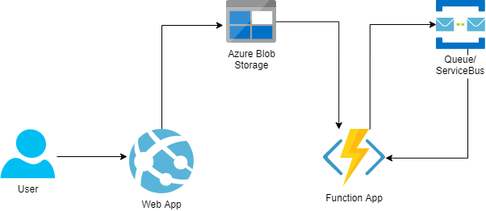

# Workshop: Serverless 

## Verktøy
#### Disse må du ha
* [Powershell](https://docs.microsoft.com/en-us/powershell/scripting/install/installing-powershell?view=powershell-7.1) 
* [Azure CLI](https://docs.microsoft.com/en-us/cli/azure/install-azure-cli)
* [dotnet](https://dotnet.microsoft.com/download) (dotnet core 3.1 eller .NET 5)
* Text editor (f.eks. VS Code eller Visual Studio)
* Tilgang til Azureskolen subscription (sjekk [her](portal.azure.com))

#### Kjekt å ha
* [Azure Storage Explorer](https://azure.microsoft.com/en-us/features/storage-explorer/)


## Kom i gang
Åpne powershell og naviger til Workshop_4/Start. Her finner du et powershell script som heter start_workshop.ps1. Vi skal kjøre dette scriptet og det setter opp infrastruktur og deployer koden som ligger i Start folderen. I Powershell gjør du følgende
* `cd azure-workshops/Workshop_4/Start` 
* `./start_workshop.ps1`
* Skriv inn navnet ditt og trykk enter
* Logg inn på bouvet brukeren din når nettleseren åpner
* Gå til portalen når scriptet er ferdig
  * Sjekk at din ressursgruppe eksisterer
  * Ved å skrive inn `$Env:Rg` vil ressursgruppen bli vist

## Test at koden er oppe og går
#### Test App Servicen 
1. Åpne [portalen](portal.azure.com)
1. Gå til App Servicen din
1. Klikk på urlen i oversikten
1. Last opp et bilde til applikasjonen
1. Vent litt og se at et bilde dukker opp

#### Test Function Appen
`ExampleFunctionHttpTrigger` er satt opp for å kunne teste og validere at Function Appen din er oppe og går. Dette er et http endepunkt som krever en query parameter. For å teste denne:
1. Åpne [portalen](portal.azure.com)
1. Gå til Function Appen din
1. Klikk på Functions på venstre side
1. Velg ExampleFunctionHttpTrigger
1. Klikk på Code + Test på venstre side
1. Klikk på Test/Run over json filen
1. Legg til en Query parameter med navn "blobName" og verdi lik navnet på et bildet du har lastet opp
   * Hvis bloben ikke eksisterer så får du en feilmelding i loggen. Last opp et bilde gjennom Web Appen og prøv så på nytt

## Function App

I `Start` mappen finner du en påbegynt Function App under `Start/AzureWorkshop/AzureWorkshopApp`, med tilhørende infrastruktur definert i `start/AzureWorkshopInfrastruktur/AzureWorkshopInfrastruktur`. Denne Function Appen er ufullstendig og oppgaven din er å utvide den. Hvis du ønsker å deploye manuelt gå til [ManuellDeploy.md](./Start/ManuellDeploy.md)

Det er lurt å lese hele README før du går i gang med å kode. Det kommer en del viktige tips og workshoppen er ganske åpen. Etter du har lest kjapt i gjennom står du fritt til å lage din egen plan for å komme i mål!  

#### Endre på koden

1. Åpne `AzureWorkshopApp` i VS Code eller Visual Studio. De fleste endringene skal gjøres i `AzureWorkshopFunctionApp`, men et par småting må fikses i `AzureWorkshopApp`.
1. Åpne `ExampleFunctionHttpTrigger.cs`, denne filen gir deg et eksempel på hvordan en Function ser ut og hvordan en trigger brukes. 
Oppgaven din er å lage nye functions som gjør endringer på bilder som sendes inn. 

Endringene som må gjøres i `AzureWorkshopApp` er å 
1. Kommentere inn knappene i `Views/Home/Index.cshtml`. Bildene som vises i frontend hentes fra en Blob container i en Storage account. Knappene gjør at man kan bytte Blob container source. 
1. I `ImagesController.cs` kan man kommentere inn en kodelinje som legger en melding med filnavn på en kø. Hvis man vil sende JSON objekter så er det også mulig. 

### Litt om Function App koden
* `Constants.cs` har konstanter som representerer containere i Storage Accounten. Her er det bare å legge til nye hvis man har lyst til å ha andre containere
* Det er satt opp Dependency Injection for `IBlobService` og `IImageService`, så nye functions burde ha en constructor som tar imot disse på samme måte som `ExampleFunctionHttpTrigger.cs`
* `BlobService` inneholder logikk for å hente blobs som Stream og lagre en Stream i en blob. Opplasting av blobs er satt til å overskrive eksisterende blobs by default
* `ImageService` har en del forskjellige metoder for å manipulere bilder. Denne kan utvides enkelt om man ønsker å gjøre mer spennende ting, anbefaler da at man fortsetter å bruke bitmap

> <b>Functions kan lages på flere forskjellige måter. Det er hovedsakelig bare vanlige C# filer (.cs) som får autogenerert litt JSON filer når man bygger og deployer koden. Du kan velge å lage Functions manuelt eller via VS Code / Visual Studio. Bruk `TemplateQueueTrigger.cs` til å verifisere at det er satt opp riktig, det er lett at man får noen feil når man autogenerer kode og det autogenereres uten Dependency Injection.</b>

**Legge til functions manuelt** 

I koden finnes det en Function template som heter `TemplateQueueTrigger.cs`. Den kan man bruke til å lage andre functions som BlobTrigger, TimerTrigger og lignende. Lag en ny cs fil og kopier over, endre så navnet på klassen og i FunctionName til å matche filnavn. 

**Legge til functions med Visual Studio**

* Høyreklikk på Functions mappen
* Trykk `Add > New Azure Function`
* Legg inn dependency injection selv (se `TemplateQueueTrigger.cs`)

**Legge til functions med VS code**

* Last ned `Azure Functions` extension
* Åpne mappen `AzureWorkshopFunctionApp` i ett eget VS Code vindu
* Gå til Azure ikonet som dukker opp på ikonmenyen på venstre side
* Med `Azure Functions` extension får du en tab som heter Functions
* I tabben skal mappen `Local Project` dukke opp (krever at kun mappen `AzureWorkshopFunctionApp` er åpen)
* Trykk på denne og initialiser den om det trengs, slik at `ExampleFunctionHttpTrigger` dukker opp under `Functions` mappen i tabben
* Legg til nye functions ved å trykke på lynikonet som er til høyre i tabheaderen
* Velg trigger type og navn
* Legg inn dependency injection selv (se `TemplateQueueTrigger.cs`)

Man kan opprette en `local.settings.json` fil og legge settings inn i den for å teste functions lokalt. For å kjøre det lokalt må AzureWebJobsStorage være satt (helst til en reell Storage Account ConnectionString)

Eksempel `local.settings.json` med lokal Development Storage Account (en virtuell Storage Account). Bytt ut AzureWebJobsStorage med en reell Storage Account ConnectionString for å bruke Azure Storage Account.
```json
{
  "IsEncrypted": false,
  "Values": {
    "AzureWebJobsStorage": "UseDevelopmentStorage=true;",
    "AzureWebJobsDashboard": ""
  }
}
```

### Oppgaven


`AzureWorkshopApp` er en bildeapp som lar deg se bilder og laste opp bilder. Oppgaven din er å lage nye Functions som manipulerer bildene ved hjelp av ulike Function triggers. Eksempel når brukeren trykker på en knapp, eller etter et nytt bilde er lastet opp. Her er målet å bli kjent med ulike Function triggers, og hvordan man faktisk implementer de.  

Ønsket sluttresultat er:
* En `http trigger` Function (denne er laget for deg)
* En `blob trigger` Function som kutter bildet til kvadrater (ImageService.Square)
* En `output queue binding` i blob trigger Functionen 
* En `queue trigger` Function som gjør bildet grått (ImageService.GreyScale) trigget via blob trigger output binding

Tilleggsfunksjonalitet man kan prøve seg på:
* En `timer trigger` Function
* Ha to `queue trigger` Functions hvor en har output binding til neste queue trigger function
* En `Service Bus trigger` Function
* Andre triggers du vil eksperimentere med

Det anbefales å deploye ofte til Azure for å teste at alt fungerer som det skal.



#### Deploy av AzureWorkshopApp

1. Åpne en Powershell
1. Naviger til `Start/AzureWorkshop/AzureWorkshopApp` mappen
1. Kjør scriptet `./DeployApp.ps1`

#### Deploy av FunctionApp

1. Åpne en terminal/powershell
1. Naviger til `Start/AzureWorkshop/AzureWorkshopFunctionApp` mappen
1. Kjør scriptet `./DeployFunction.ps1`


### Står du fast?
I `komplett` mappen så vil man kunne se et eksempel på hvordan løsningen kan se ut. Dette er ikke en fasit, da man står helt fritt til hvordan man vil løse denne oppgaven.

> Google er din beste venn

